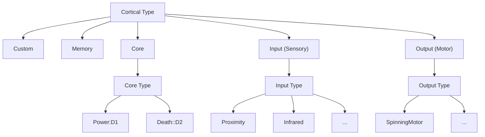

# Genomic Structures
This module contains types which describe the structure of a FEAGI Genome

## Cortical Dimensions
Describes the dimensions of a cortical area along the X Y Z axis. Essentially a Struct containing a u32 for X Y Z values with verification that the value is not zero.

## Single Channel Dimensions
Defines the fixed size of a given channel within a input / output cortical area in the X Y Z directions.

## Single Channel Dimension Requirements
Different input / output cortical types can define data resolution by allowing various axis to be user defined. This structure is used by cortical types to define which axis of a given type have a fixed size, and which do not.

## Cortical ID
A unique identifier for a cortical area in a genome. Consists of 6 ASCII AlphaNumeric characters. In addition, they also follow the following formatting rules:
- The first character describes the type of cortical area represented
  - 'c': Custom cortical area
  - 'm': Memory cortical area
  - '_': Core cortical area
  - 'i': Input (Sensor) cortical area
  - 'o': Output (Motor) cortical area
  - Anything else is invalid for the first character
- For Custom / Memory cortical areas, the next 5 values can be any alphanumeric character
- For Core cortical areas, as there are a set universal number of core areas, they will map to those specifically.
- For Input / Output cortical areas
  - The second, third, and fourth character will map to a specific cortical type
  - The fifth and sixth characters together represent the cortical areas Cortical Grouping Index, in hexadecimal

These generally should not be instantiated directly, and instead be instantiated with one of the many helper functions.

## Cortical Type
A nested enum that can be used to describe the type of cortical area, and the subtype (in the cases of Core, Input, and Output cortical areas as there are a set number of types of those). Has plenty of helper methods to check restrictions and details of various types of cortical areas.

To see an explanation of all possible Input / Output cortical types in FEAGI, please read the FEAGI documentation here (TODO).

This enum can be instantiated with one of its many "constructor" helper functions for ease of use.

## Index Types
Specific types for denoting the index of something. Used instead of directly using ints to avoid confusion, but are essentially just ints.

### Cortical Grouping Index
Used to differentiate between multiple input / output cortical areas of the same input / output type. Stored as a u8.

### Cortical IO Channel Index
Used within a single input / output cortical area as a channel index (as a single cortical area can have multiple channels for multiple devices). Stored as a u32.

### Agent Device Index
Helper index used on the physical hardware side to map a input / output device toward / from a specific input / output cortical area and channel. It is possible to have multiple Agent Device Indexes map to the same cortical area and channel number in sensors. Stored as a u32.

