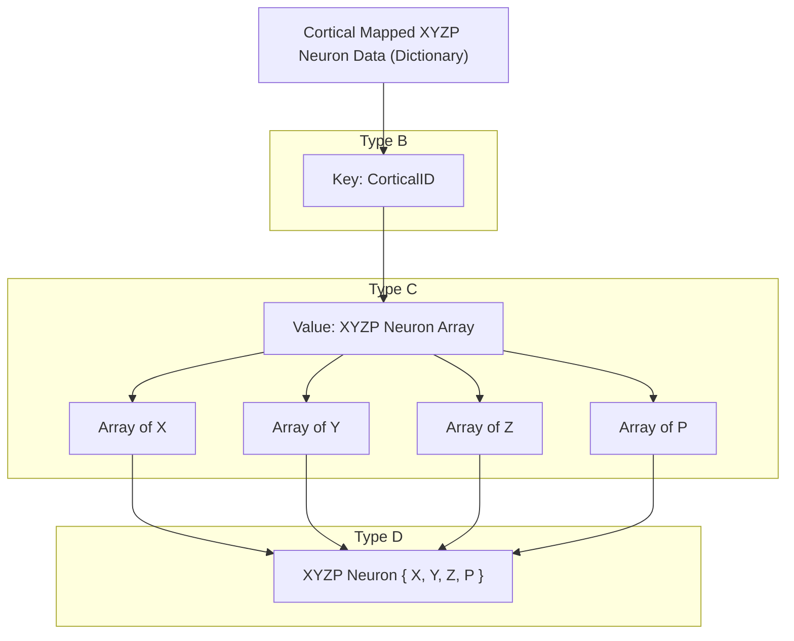

# Neuron Data
Neuron state in FEAGI is expressed as potential, a positive or negative float value representing the voltage across the simulated neuron. We encode this and the location of the neuron in its parent cortical area.

## Neuron Data Formats
Right now there exists only a single Neuron Data format, but this will be expanded in the future.

### NeuronXYZP
4 element structure, with potential being stored as a float, and the 3D position relative to the cortical area of the neuron being stores as u32 X Y Z coordinates. Fast, easy, but not particularly memory space efficient.

## Neuron Arrays

Each neuron type has its own array structure, which stores neuron data for a single given cortical area. These arrays are sparse and unordered, meaning if there is no potential given for a given neuron position in a cortical area, we can assume neutral potential (not firing). It is important to note that for processing reasons, we separate the elements of the given neuron type each into their own flat array. The array structs also give useful methods for working with the internal data.

## Cortical Mapped Neuron Data

Effectively a dictionary mapping the CorticalID of a cortical area with the Neuron Array for that cortical area. Contains Functions for interacting with the data, and for serialization and deserialization.

# Example layout using the XYZP Neuron Data type

## Encoders / Decoders
While FEAGI works with neuron data, a vast majority of devices instead work with numerical types such as Ints and Floats. Encoders are used to convert standard data in neuron forms, and Decoders can convert neuronal data into standard data. 

Encoder / Decoder structures do have to be instantiated by the user to define parameters such as resolution, and neuron encoding type for the given neuron data it will be processing. Essentially, these coders are configurable functions for converting data to/from neuronal form.